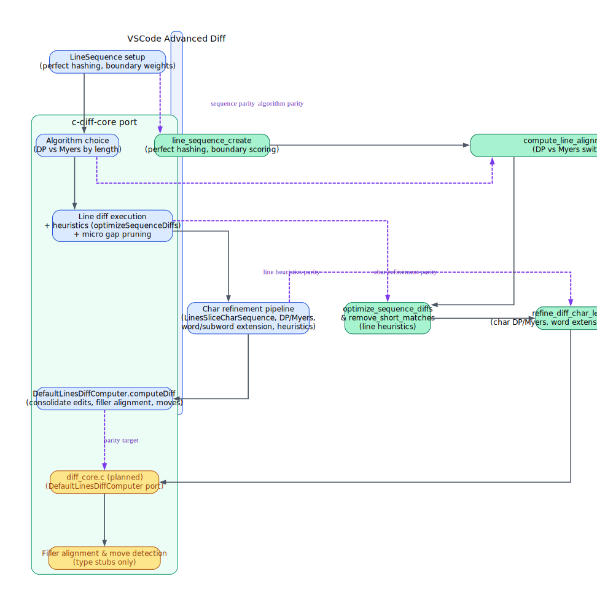

# Advanced Diff Parity Midterm Evaluation (Steps 1–4)

## Completed Parity (Steps 1–4)

| Feature | VSCode Source | c-diff-core Source | Parity Score (1–5) | Notes |
| --- | --- | --- | --- | --- |
| Line sequence infrastructure (perfect hashing, boundary scoring) | `LineSequence` hashing and indentation-based scores.【F:src/vs/editor/common/diff/defaultLinesDiffComputer/lineSequence.ts†L10-L35】 | `line_sequence_create` and `line_seq_get_boundary_score` mirror hashing and indentation scoring, reusing a shared perfect hash map.【F:c-diff-core/src/sequence.c†L60-L174】 | 5 | Data model and hashing behavior match, enabling identical equality and boundary semantics.
| Line alignment algorithm selection (DP ↔ Myers) | Size-based switch between dynamic programming and Myers O(ND).【F:src/vs/editor/common/diff/defaultLinesDiffComputer/defaultLinesDiffComputer.ts†L63-L92】 | `compute_line_alignments` applies the same threshold and equality scoring callback before running the corresponding Myers variant.【F:c-diff-core/src/line_level.c†L83-L134】 | 5 | Produces the same line alignment candidates and timeout propagation.
| Line-level heuristic optimizations | `optimizeSequenceDiffs` (join/shift) and `removeVeryShortMatchingLinesBetweenDiffs` refine diff spans.【F:src/vs/editor/common/diff/defaultLinesDiffComputer/heuristicSequenceOptimizations.ts†L12-L358】 | `optimize_sequence_diffs`, `remove_short_matches`, and `remove_very_short_matching_lines_between_diffs` replicate joining, shifting, and micro-gap collapsing behavior.【F:c-diff-core/src/optimize.c†L1-L399】 | 5 | Heuristic structure, boundary scoring, and repeat-loop semantics align.
| Character refinement pipeline (DP/Myers, word/subword extension, micro heuristics) | `refineDiff` orchestrates LinesSliceCharSequence creation, DP/Myers selection, word/subword extension, and micro-gap heuristics.【F:src/vs/editor/common/diff/defaultLinesDiffComputer/defaultLinesDiffComputer.ts†L200-L238】【F:src/vs/editor/common/diff/defaultLinesDiffComputer/heuristicSequenceOptimizations.ts†L203-L323】 | `refine_diff_char_level` mirrors the same sequence creation, algorithm selection, word/subword extension, and micro-gap pruning stages.【F:c-diff-core/src/char_level.c†L640-L716】【F:c-diff-core/src/char_level.c†L240-L565】 | 4 | Stage ordering and heuristics are present; see divergence notes for boundary scoring subtleties.

**Scoring legend:** 5 = full parity, 4 = high parity with minor gaps, 3 = partial parity, 2 = limited parity, 1 = no parity.

## Known Divergences (Steps 1–4)

1. **Character boundary scoring lacks category fidelity (Parity ≈ 2/5, Impact: Medium).**
   * VSCode classifies boundaries using categorical weights (word casing, separators, end-of-sequence) before scoring shifts.【F:src/vs/editor/common/diff/defaultLinesDiffComputer/linesSliceCharSequence.ts†L71-L99】
   * The C port only checks broad word/whitespace cases and returns zero for offsets at sequence edges, skipping category weights and end-of-sequence bonuses.【F:c-diff-core/src/sequence.c†L232-L282】
   * **Effect:** `shift_sequence_diffs` loses the nuanced scores that bias diffs toward camelCase, punctuation, and EOF boundaries, reducing parity on tricky char-level alignments.
   * **Estimated work:** Re-implement category enums, sentinel handling, and score table (~1–2 focused coding sessions).

2. **Range translation does not support left-edge preference (Parity ≈ 2/5, Impact: Medium).**
   * VSCode’s `translateOffset` distinguishes left/right preferences so that end positions landing at trimmed line starts omit leading whitespace re-addition.【F:src/vs/editor/common/diff/defaultLinesDiffComputer/linesSliceCharSequence.ts†L101-L118】
   * The C translation always applies the “right” preference, reintroducing trimmed whitespace even when the target offset sits at a line start.【F:c-diff-core/src/sequence.c†L425-L466】
   * **Effect:** Character ranges can overshoot by the trimmed indentation width, creating column mismatches versus VSCode output in whitespace-trimmed scenarios.
   * **Estimated work:** Thread a preference flag (or equivalent logic) through translation and RangeMapping emission (~1 coding session).

## Optional Next Steps

* Finish the consolidated driver (`diff_core.c`) to wrap line/char pipelines and add move detection/filler alignment, following `DefaultLinesDiffComputer.computeDiff` in the TypeScript source.【F:src/vs/editor/common/diff/defaultLinesDiffComputer/defaultLinesDiffComputer.ts†L63-L186】
* Address the boundary scoring and translation gaps above before layering filler-line alignment to avoid compounding geometry issues.

