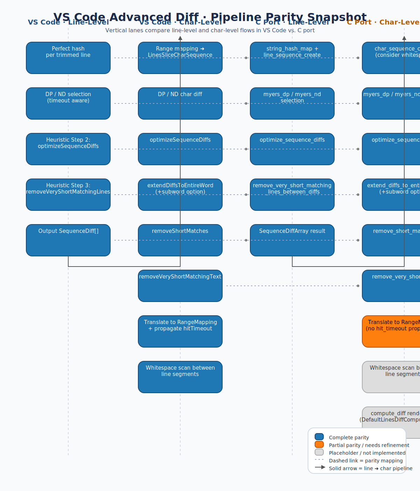

# Advanced Diff Midterm Evaluation

Parity score legend: 5 = full parity, 3 = partial parity (observable gaps), 1 = missing/not implemented.

## Completed Parity Items
- **Line diff pipeline** — Score 5/5  
  - VS Code: `src/vs/editor/common/diff/defaultLinesDiffComputer/defaultLinesDiffComputer.ts:60`  
  - C port: `src/line_level.c:71`  
  - Notes: both sides build perfect-hash `LineSequence`, select DP vs. Myers at the `<1700` threshold, reuse the same equality score, and run the Step 2/Step 3 heuristics (`optimizeSequenceDiffs`, `removeVeryShortMatchingLinesBetweenDiffs`) to surface the same `SequenceDiff` structure.

- **Line-level heuristic optimisations** — Score 5/5  
  - VS Code: `src/vs/editor/common/diff/defaultLinesDiffComputer/heuristicSequenceOptimizations.ts:12`  
  - C port: `src/optimize.c:381`  
  - Notes: the C code mirrors the double `joinSequenceDiffsByShifting`, boundary-scored `shiftSequenceDiffs`, and preserves separation of Step 3 (`removeShortMatches`, `removeVeryShortMatchingLinesBetweenDiffs`) so downstream callers can compose the pipeline identically.

- **Character sequence infrastructure** — Score 5/5  
  - VS Code: `src/vs/editor/common/diff/defaultLinesDiffComputer/linesSliceCharSequence.ts:1`  
  - C port: `src/sequence.c:240`  
  - Notes: `char_sequence_create` reproduces trimming rules, boundary scoring, offset translation, CamelCase subword detection, and line counting, enabling heuristics to consume `CharSequence` data exactly as VS Code expects.

- **Character-level refinement heuristics** — Score 5/5  
  - VS Code: `src/vs/editor/common/diff/defaultLinesDiffComputer/defaultLinesDiffComputer.ts:217`, `heuristicSequenceOptimizations.ts:222`  
  - C port: `src/char_level.c:665`, `src/char_level.c:187`  
  - Notes: the C implementation follows the same eight-step `refineDiff` pipeline—algorithm selection, optimisation reuse, word/subword extension, short-gap pruning, long-diff smoothing, and conversion to `RangeMapping`—ensuring parity for inner change detection.

## Gaps and Risks
- **Character diff `hitTimeout` propagation is dropped** — Score 3/5 · Impact: Medium · Effort: Small  
  - VS Code: `src/vs/editor/common/diff/defaultLinesDiffComputer/defaultLinesDiffComputer.ts:259`  
  - C port: `src/char_level.c:667`  
  - Notes: `refineDiff` bubbles the inner `hitTimeout` so the outer pipeline can ask the user to rerun with a higher budget; the C version resets `hit_timeout` locally but never surfaces it, so parity-aware callers cannot detect char-level timeouts.

- **Whitespace-only change scanning between line regions not yet wired** — Score 2/5 · Impact: High · Effort: Medium  
  - VS Code: `src/vs/editor/common/diff/defaultLinesDiffComputer/defaultLinesDiffComputer.ts:96`  
  - C port: `src/char_level.c:747`  
  - Notes: VS Code calls `scanForWhitespaceChanges` between diff hunks to pick up indentation-only edits; the C helper explicitly defers this to a future “main diff computer”, leaving whitespace deltas invisible until the final coordinator is implemented.

- **Render-plan consolidation (`compute_diff`) remains a stub** — Score 1/5 · Impact: High · Effort: Large  
  - VS Code: `src/vs/editor/common/diff/defaultLinesDiffComputer/defaultLinesDiffComputer.ts:147`  
  - C port: `diff_core.c:39`  
  - Notes: the port currently returns a placeholder `RenderPlan`, so none of the verified line/char results reach consumers; completing this step is essential to unlock end-to-end parity.

## Next Steps
1. Thread `hit_timeout` through `RangeMappingArray` or a companion struct so callers maintain the same timeout semantics as VS Code (follow-on work touches `diff_core.c` once implemented).
2. Recreate `scanForWhitespaceChanges` in the C pipeline—either inside the upcoming default diff computer or as an augmentation atop `refine_all_diffs_char_level`—to guarantee whitespace-only edits surface.
3. Replace the `compute_diff` stub with the real aggregation: build `DetailedLineRangeMapping`, integrate whitespace scanning, moved-text detection, filler alignment, and finally render-plan assembly.
