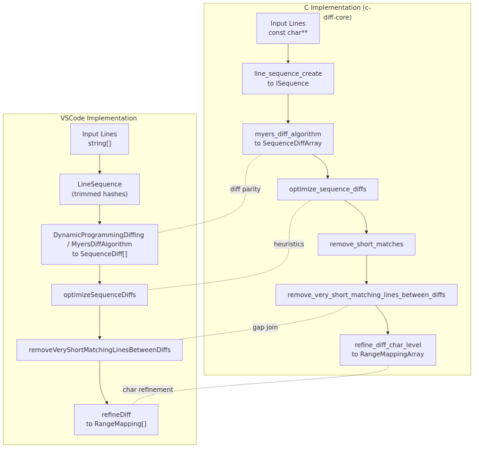

# Advanced Diff Midterm Evaluation (English)

## Parity Summary

- **Step&nbsp;1 – Core Myers diff (0.6 / 1.0, partial parity).** The C implementation reproduces the forward O(ND) traversal, negative-diagonal storage, snake backtracking, and timeout handling through `myers_diff_algorithm`, producing sorted `SequenceDiffArray` output just like VS Code’s TypeScript Myers engine.【F:c-diff-core/src/myers.c†L190-L358】【F:vscode/src/vs/editor/common/diff/defaultLinesDiffComputer/algorithms/myersDiffAlgorithm.ts†L12-L103】 However, VS Code swaps to the dynamic-programming scorer for small inputs, while the C port always stays on Myers, so the parity is only partial.【F:vscode/src/vs/editor/common/diff/defaultLinesDiffComputer/defaultLinesDiffComputer.ts†L66-L87】
- **Steps&nbsp;2–3 – Line-level heuristics (0.5 / 1.0, partial parity).** Joining-and-shifting diffs, short-gap coalescing, and removal of tiny unchanged islands are implemented with the same sequencing of helpers in C as in TypeScript.【F:c-diff-core/src/optimize.c†L324-L488】【F:vscode/src/vs/editor/common/diff/defaultLinesDiffComputer/heuristicSequenceOptimizations.ts†L12-L369】 Still, the boundary scoring diverges—the C port favours blank/brace lines while VS Code uses indentation cost—and the hashing scheme relies on FNV instead of the collision-free perfect hashes used upstream.【F:c-diff-core/src/sequence.c†L43-L152】【F:vscode/src/vs/editor/common/diff/defaultLinesDiffComputer/lineSequence.ts†L24-L45】【F:vscode/src/vs/editor/common/diff/defaultLinesDiffComputer/defaultLinesDiffComputer.ts†L50-L65】 These differences can change optimisation choices.
- **Step&nbsp;4 – Character refinement (0.4 / 1.0, partial parity).** The C pipeline mirrors the TypeScript refine flow—building `CharSequence`s, reusing line heuristics, extending to words/subwords, pruning short matches, and producing range mappings.【F:c-diff-core/src/char_level.c†L569-L646】【F:vscode/src/vs/editor/common/diff/defaultLinesDiffComputer/defaultLinesDiffComputer.ts†L217-L262】 Parity gaps remain: the DP fallback is skipped, the word-extension logic does not consume overlapping equal mappings the way VS Code does, and the character-to-position translation lacks the trimmed whitespace bookkeeping that TypeScript keeps in `LinesSliceCharSequence` when whitespace is ignored.【F:c-diff-core/src/char_level.c†L588-L592】【F:c-diff-core/src/char_level.c†L242-L295】【F:c-diff-core/src/sequence.c†L320-L435】【F:vscode/src/vs/editor/common/diff/defaultLinesDiffComputer/heuristicSequenceOptimizations.ts†L222-L298】【F:vscode/src/vs/editor/common/diff/defaultLinesDiffComputer/linesSliceCharSequence.ts†L20-L118】 VS Code also rescans equal regions for whitespace-only differences, which the current C helper explicitly defers.【F:c-diff-core/src/char_level.c†L652-L683】【F:vscode/src/vs/editor/common/diff/defaultLinesDiffComputer/defaultLinesDiffComputer.ts†L96-L119】 

## Differences and Gaps

- **Dynamic-programming fallback absent (impact high, est. work medium).** Add a size-based switch so small sequences use an LCS scorer like VS Code’s `DynamicProgrammingDiffing`; without it, short files/regions can diverge because the C path never takes the alternative algorithm.【F:c-diff-core/src/myers.c†L190-L358】【F:vscode/src/vs/editor/common/diff/defaultLinesDiffComputer/defaultLinesDiffComputer.ts†L66-L87】【F:vscode/src/vs/editor/common/diff/defaultLinesDiffComputer/defaultLinesDiffComputer.ts†L224-L226】 
- **Boundary scoring and hashing mismatch (impact medium, est. work medium).** Replacing the indentation-based weighting with brace/blank heuristics plus FNV hashes changes which splice points rank highest and introduces possible collisions versus VS Code’s perfect hashes.【F:c-diff-core/src/sequence.c†L43-L152】【F:vscode/src/vs/editor/common/diff/defaultLinesDiffComputer/lineSequence.ts†L24-L45】【F:vscode/src/vs/editor/common/diff/defaultLinesDiffComputer/defaultLinesDiffComputer.ts†L50-L65】 
- **Word-extension handling diverges (impact medium, est. work medium).** VS Code keeps consuming and merging overlapping equal spans while the C `extend_diffs_to_entire_word` inspects each equal block in isolation, so camelCase expansions can stop early.【F:c-diff-core/src/char_level.c†L242-L295】【F:vscode/src/vs/editor/common/diff/defaultLinesDiffComputer/heuristicSequenceOptimizations.ts†L222-L298】 
- **Column translation without trimmed offsets (impact high, est. work high).** `char_sequence_translate_offset` currently maps offsets directly, but TypeScript preserves leading/trailing trim lengths per line so ignored whitespace can be restored when producing ranges; this gap skews range outputs whenever whitespace trimming is active.【F:c-diff-core/src/sequence.c†L320-L435】【F:vscode/src/vs/editor/common/diff/defaultLinesDiffComputer/linesSliceCharSequence.ts†L20-L118】 
- **Whitespace-only scans between line diffs missing (impact medium, est. work medium).** The TypeScript pipeline re-invokes character diffing on equal regions to surface whitespace edits, whereas the current C helper defers that responsibility entirely.【F:c-diff-core/src/char_level.c†L652-L683】【F:vscode/src/vs/editor/common/diff/defaultLinesDiffComputer/defaultLinesDiffComputer.ts†L96-L119】 

## Suggested Next Steps

1. **Introduce DP fallback for short sequences.** Wire a length threshold and port `DynamicProgrammingDiffing` so both line and character paths match VS Code’s algorithm selection.【F:vscode/src/vs/editor/common/diff/defaultLinesDiffComputer/defaultLinesDiffComputer.ts†L66-L87】【F:vscode/src/vs/editor/common/diff/defaultLinesDiffComputer/defaultLinesDiffComputer.ts†L224-L226】 
2. **Align boundary scoring and hashing.** Replace the FNV hashes with per-string IDs and port the indentation-based `getBoundaryScore` to reproduce VS Code’s cost model.【F:c-diff-core/src/sequence.c†L43-L152】【F:vscode/src/vs/editor/common/diff/defaultLinesDiffComputer/lineSequence.ts†L24-L45】【F:vscode/src/vs/editor/common/diff/defaultLinesDiffComputer/defaultLinesDiffComputer.ts†L50-L65】 
3. **Rework word/subword extension.** Match VS Code’s queue-based equal-mapping consumption to ensure contiguous camelCase segments expand identically.【F:c-diff-core/src/char_level.c†L242-L295】【F:vscode/src/vs/editor/common/diff/defaultLinesDiffComputer/heuristicSequenceOptimizations.ts†L222-L298】 
4. **Track trimmed whitespace metadata in `CharSequence`.** Store per-line offsets like VS Code’s `LinesSliceCharSequence` so translation back to line/column positions remains faithful when whitespace is suppressed.【F:c-diff-core/src/sequence.c†L320-L435】【F:vscode/src/vs/editor/common/diff/defaultLinesDiffComputer/linesSliceCharSequence.ts†L20-L118】 
5. **Port whitespace-only rescanning.** After line diffs, rescan equal sections for ignored whitespace edits to match VS Code’s handling of `ignoreTrimWhitespace` mode.【F:c-diff-core/src/char_level.c†L652-L683】【F:vscode/src/vs/editor/common/diff/defaultLinesDiffComputer/defaultLinesDiffComputer.ts†L96-L119】 
